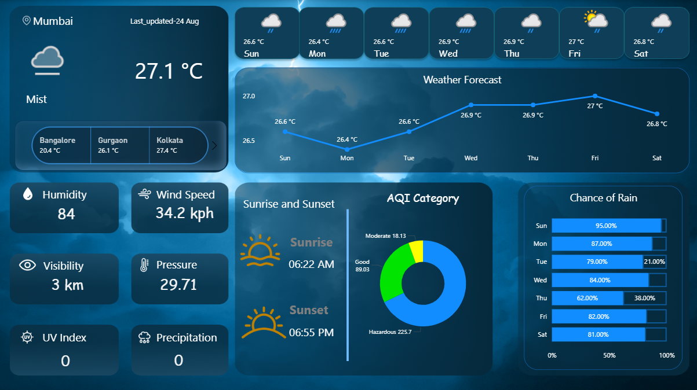

# 🌤️ Weather Forecast Power BI Dashboard

<div align="center">
  
  <p><em>Interactive Weather Forecast Dashboard - Real-time data visualization for Indian cities</em></p>
</div>

## 📌 **Project Overview**
An interactive Power BI dashboard that visualizes real-time weather forecasts and environmental conditions for major Indian cities using WeatherAPI integration. This comprehensive solution provides 7-day forecasts with hourly breakdowns, air quality monitoring, and UV index tracking.

## 🎯 **Objective**
Create a dynamic weather analytics platform that empowers farmers, travelers, city planners, and businesses to make data-driven decisions based on accurate weather forecasts and environmental conditions across multiple Indian metropolitan areas.

## 🔍 **Key Business Questions Addressed**
- **🌡️ Temperature Trends**: What are the daily and hourly temperature patterns across Noida, Gurgaon, Mumbai, Bangalore, and Kolkata?
- **💨 Air Quality Insights**: How does air quality index (AQI) vary by city and time, and which areas have the highest pollution levels?
- **🌬️ Wind & Weather Patterns**: Which hours experience peak wind speeds, and how do weather conditions change throughout the day?
- **☀️ UV & Health Impact**: What are the UV index levels across different cities to help plan outdoor activities?
- **📊 Comparative Analysis**: How do weather conditions compare between major Indian cities for strategic planning?
- **🚜 Agricultural Planning**: How can accurate forecasts support farming decisions and crop management?

## 🛠️ **Technology Stack**
- **Power BI**: Dashboard creation and data visualization
- **Power Query**: Data transformation and API integration  
- **DAX**: Advanced calculations and custom measures
- **WeatherAPI**: Real-time weather data source
- **JSON API**: Data extraction and parsing
- **Power BI Service**: Cloud deployment and sharing

## ✨ **Interactive Features**
- **🎛️ Dynamic City Selection**: Filter and compare weather data across multiple cities
- **📅 Time-based Analysis**: Switch between daily and hourly forecast views
- **🎨 Conditional Formatting**: Color-coded temperature ranges and AQI levels
- **📱 Mobile Responsive**: Optimized for viewing on different devices
- **🔄 Auto-refresh**: Real-time data updates with parameterized API integration
- **📈 Trend Analysis**: Historical comparison and forecasting capabilities
- **⚡ Drill-through Functionality**: Deep-dive into specific time periods or conditions

## 🚀 **Enhanced Dashboard Components**
- **Weather Summary Cards**: Current temperature, humidity, and conditions at a glance
- **Multi-city Comparison Matrix**: Side-by-side weather metrics for strategic planning
- **Hourly Temperature Heatmap**: Visual representation of temperature fluctuations
- **Air Quality Monitoring Panel**: Real-time AQI tracking with health recommendations
- **Wind Speed & Direction Compass**: Interactive wind pattern visualization
- **UV Index Safety Indicator**: Color-coded UV warnings for outdoor activity planning
- **Precipitation Probability Charts**: Rain/snow forecast accuracy for planning
- **Weather Alerts Integration**: Severe weather warnings and notifications

## 📊 **Key Performance Indicators (KPIs)**
- **Average Daily Temperature** by city and season
- **Maximum Wind Speed** recorded across locations
- **Air Quality Index Summary** with health impact categories  
- **UV Index Risk Levels** for outdoor activity planning
- **Precipitation Probability** for agricultural and event planning
- **Humidity Comfort Zones** for indoor climate optimization

## 🎯 **Business Impact & Use Cases**
- **🌾 Agriculture**: Crop planning, irrigation scheduling, and harvest timing optimization
- **✈️ Travel & Tourism**: Trip planning with weather-aware recommendations  
- **🏗️ Construction**: Weather-dependent project scheduling and safety planning
- **🚚 Logistics**: Route optimization based on weather conditions
- **⚡ Energy Management**: Demand forecasting for heating/cooling systems
- **🏃 Health & Fitness**: Outdoor activity recommendations based on UV and AQI

## 🔧 **Technical Implementation**
The dashboard leverages parameterized queries with secure API key management, ensuring easy maintenance and updates. Custom DAX measures provide advanced analytics capabilities, while Power Query transformations handle complex JSON data structures from WeatherAPI endpoints.

### 🔑 **API Key Configuration**
```
**Note**: API keys may expire periodically. When updating, simply replace the parameter in Power Query Editor:
1. Go to **Data** > **Transform Data**
2. Navigate to **Manage Parameters**
3. Update the `API_Key` parameter with the new key
4. Refresh all queries

```

## 📈 **Future Enhancements**
- **🤖 Machine Learning Integration**: Predictive weather modeling
- **📧 Automated Alerts**: Email/SMS notifications for severe weather
- **🌍 Geographic Expansion**: Additional cities and international locations  
- **📱 Mobile App Integration**: Native mobile dashboard experience
- **🔗 IoT Sensor Integration**: Combine API data with local sensor readings

---

### 🔄 **Data Refresh**
Dashboard automatically updates with fresh data every hour. The parameterized API key system allows seamless token rotation without rebuilding queries. Simply update the API key parameter when needed and refresh the dataset.

### 📷 **Adding Dashboard Images**
To include dashboard screenshots in your repository:


### 📞 **Support & Contributions**
Feel free to raise issues or contribute enhancements to make this weather dashboard even more powerful and user-friendly!
